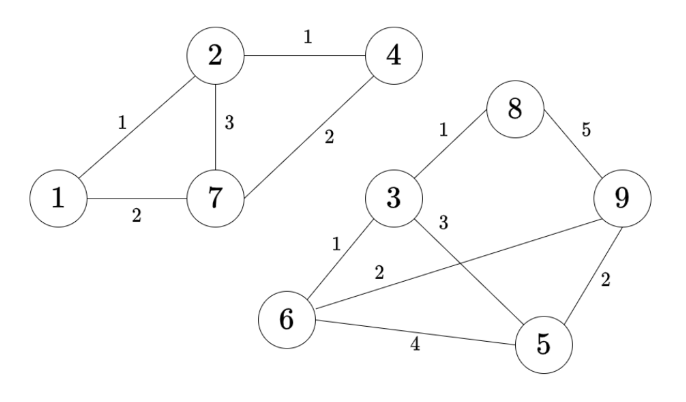
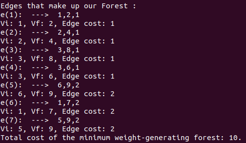
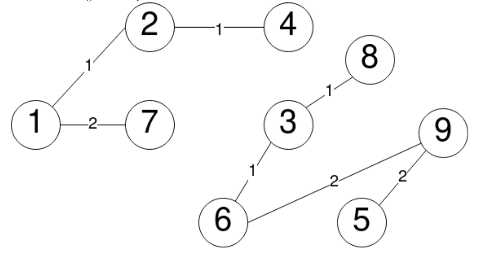

# Minimum Weight Generator Forest(Bosque generador de peso mínimo)

* By José Manuel Pedro Méndez On July-4-2022

## Information about what I use to solve the problem 📋

* [PriorityQueue](https://www.geeksforgeeks.org/priorityqueue-comparator-method-in-java/) - Priority Queue used.
 

* [Use of Comparator](https://www.geeksforgeeks.org/comparator-interface-jav) to comparate the weight of each edge.

* [Presentation]() about Disjoint sets: Sublinear time processing. 📖


## Run the program 🔧

* First, for compile the program only execute/run in the src forder: 

```
$ javac KruskalMWGF.java
```

* Second, for run the program only execute/run in the src forder: 

```
$ javac java KruskalMWGF Example.txt
```

## Input

* The graph G is given by the file E:

|  |
|:---------------------------:|
| Example.txt content. |

* Graph G

|  |
|:---------------------------:|
| Graph G. |

## Output

* Terminal representation of the minimum cost spanning forest of G.

|  |
|:---------------------------:|
| Minimum cost spanning forest of G on terminal. |

* Minimum cost spanning forest of G.

|  |
|:---------------------------:|
| Minimum cost spanning forest of G. |

## Expressions of gratitude 🎁
* Share and tell others about this project 📢
---
⌨️ con ❤️ por [Jose-MPM](https://github.com/Jose-MPM) 😊⌨️
